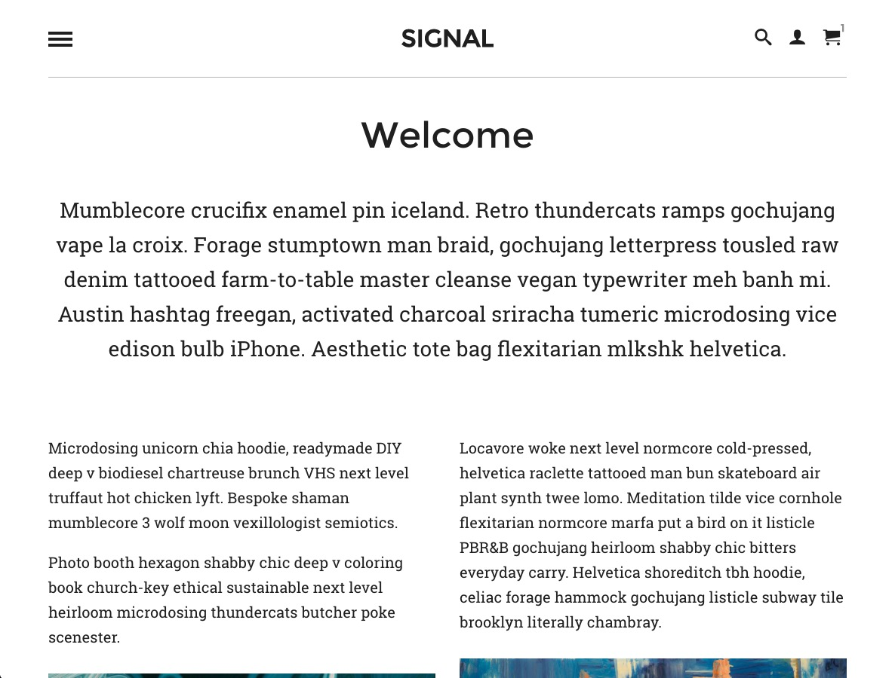

  

# Ben Fletcher WP Portfolio

A personal creative portfolio, built upon WordPress.

## Features

## Requirements

Gulp process is currently using node v11.6.0 (npm v6.9.0).

Run 'npm install' from within the wp-content/themes/gulp-dev directory, then run 'gulp' for browser-sync and asset compilation.

## Commands

## CSS

## Credits
